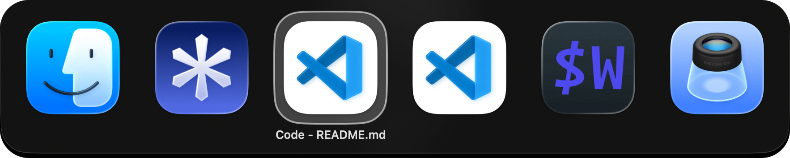
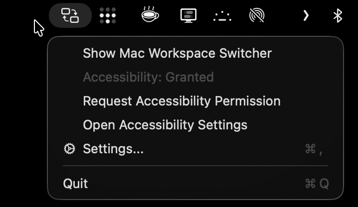
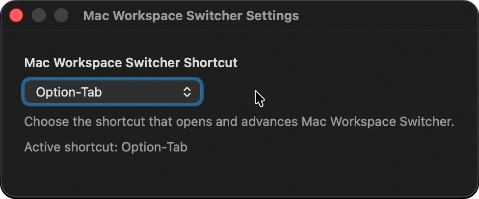

<div align="center">

# Mac Workspace Switcher

[](./LICENSE)
[](https://github.com/frittlechasm/macswitch/releases)



_Switch between individual windows in your current macOS workspace._

</div>

## Install

v0.1.0 is a source-only release. A prebuilt application is not available yet.

Requires macOS 13 or later.

To build and run from source:

```bash
git clone https://github.com/frittlechasm/macswitch.git
cd macswitch
CODESIGN_IDENTITY=- scripts/run-app-bundle.sh
```

A signed and notarized download is planned for v0.1.2.

## Usage

Grant Accessibility permission when prompted, then press `Option-Tab` to open the switcher.
Keep pressing `Tab` or use the arrow keys to move between windows.
Release `Option` or press `Return` to select; press `Escape` to cancel.

Use the menu-bar item to check permission status or choose a different shortcut in Settings.

## Switcher

Mac Workspace Switcher focuses on visible windows in your current macOS Space.
Multiple windows from the same app appear as separate choices, with the selected window title shown below its app icon.

There is no hard-coded app blacklist for now. By default, the switcher excludes:

- Menu-bar-only and background apps, plus apps currently hidden by macOS.
- Minimized windows and windows on other Spaces.
- Sheets, dialogs, custom non-standard windows, and desktop elements.
- Elevated floating windows such as browser Picture-in-Picture players.

## Settings

Use the menu-bar controls to manage Accessibility permission or select a different shortcut.

<div align="center">
  
  
</div>

## How it works

- Runs as a native Swift/AppKit menu-bar app with no third-party dependencies.
- Shows visible, non-minimized windows from the current macOS Space.
- Uses public macOS Accessibility APIs to discover and focus windows.

## Uninstall

Quit Mac Workspace Switcher from its menu-bar item, then move **Mac Workspace Switcher** from Applications to the Trash.

To also remove the saved shortcut and Accessibility permission record:

```bash
defaults delete com.frittlechasm.mac-workspace-switcher
tccutil reset Accessibility com.frittlechasm.mac-workspace-switcher
```

## License

MIT
